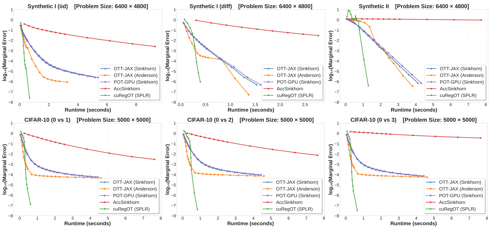

# RegOT-CUDA

**RegOT-CUDA (cuRegOT)** is a CUDA-accelerated library for optimal transport computation, providing high-performance implementations of regularized optimal transport algorithms.

As a complement to this library, the [RegOT-Python](https://github.com/yixuan/regot-python) repository provides efficient CPU-based solvers for regularized optimal transport.

## Work in Progress

RegOT-CUDA is a work in progress. Currently we have implemented the block coordinate descent algorithm (BCD, equilavent to the well-known Sinkhorn algorithm) and the sparse-plus-low-rank quasi-Newton method (SPLR) for entropic-regularized optimal transport. More state-of-the-art solvers are under development, and a list of candidate algorithms can be found in the [RegOT-Python](https://github.com/yixuan/regot-python) package.

## Requirements

- Python >= 3.11
- NumPy >= 1.23.0
- PyTorch >= 2.10 (optional, for PyTorch interface)
- CUDA Toolkit >= 13.0
- The [cuDSS](https://developer.nvidia.com/cudss) library
- Compatible NVIDIA GPU
- C++ compiler (C++11 or higher, for building from source)

## Installation

### Environment Setup

The CUDA development environment is required to build this package from source.
You can install the C++ compiler and CUDA libraries using Conda:

```bash
# Create CUDA development environment
conda create -n nvdev
conda activate nvdev
conda install python=3.12 gxx_linux-64
conda install -c nvidia cuda-toolkit=13.2 libcudss-dev cuda-nvtx-dev
pip install torch --index-url https://download.pytorch.org/whl/cu130
pip install numpy requests pybind11
```

You also need to set the `CUDA_HOME` environment variable, for example:

```bash
export CUDA_HOME=/usr/local/cuda
```

If you use the Conda installation method above, you can run the following command to set the environment variable for the virtual environment:

```bash
conda activate nvdev
conda env config vars set CUDA_HOME="<path_to_conda>/envs/nvdev/"
```

### Build and Install

```bash
cd regot-cuda
pip install --no-build-isolation .
```

### Verify Installation

```bash
python -c "import curegot; print('RegOT-CUDA imported successfully')"
```

## Usage

NumPy interface:

```python
import numpy as np
import curegot

# Create data
np.random.seed(123)
n, m = 100, 80
M = np.random.rand(n, m)  # Cost matrix
a = np.random.rand(n)     # Source distribution
a = a / np.sum(a)         # Normalize
b = np.random.rand(m)     # Target distribution
b = b / np.sum(b)         # Normalize
reg = 0.1                 # Regularization parameter

# Call algorithm
result1 = curegot.numpy.sinkhorn_bcd(M, a, b, reg, tol=1e-6, max_iter=1000, verbose=0)
plan1 = result1["plan"]
print(plan1[:3, :3])

result2 = curegot.numpy.sinkhorn_splr(M, a, b, reg, tol=1e-6, max_iter=1000, verbose=0)
plan2 = result2["plan"]
print(plan2[:3, :3])
```

PyTorch interface:

```python
import torch
import curegot

# Create data
torch.manual_seed(123)
n, m = 100, 80
device = "cuda" if torch.cuda.is_available() else "cpu"
M = torch.rand(n, m, device=device)  # Cost matrix
a = torch.rand(n, device=device)     # Source distribution
a = a / torch.sum(a)                 # Normalize
b = torch.rand(m, device=device)     # Target distribution
b = b / torch.sum(b)                 # Normalize
reg = 0.1                            # Regularization parameter

# Call algorithm
result1 = curegot.torch.sinkhorn_bcd(M, a, b, reg, tol=1e-6, max_iter=1000, verbose=0)
plan1 = result1["plan"]
print(plan1[:3, :3])

result2 = curegot.torch.sinkhorn_splr(M, a, b, reg, tol=1e-6, max_iter=1000, verbose=0)
plan2 = result2["plan"]
print(plan2[:3, :3])
```

## Tests

```bash
cd regot-cuda/test
pip install regot
python test_sinkhorn_bcd.py
python test_sinkhorn_splr.py
```

## Benchmark

The plot below shows the benchmark result for some popular GPU-based solvers. The horizontal axis represents the elapsed wall time, and the vertical axis is the optimization error on a logarithmic scale. Lower curves indicate better performance, achieving lower errors in less time.

More details on the benchmark will be provided soon.


